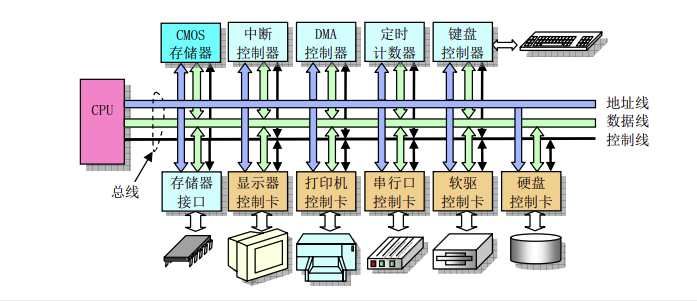
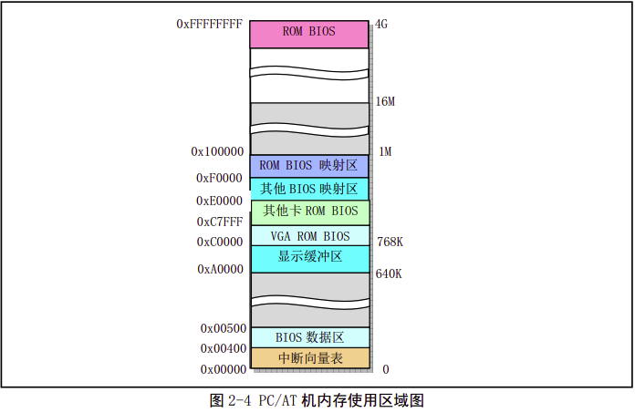
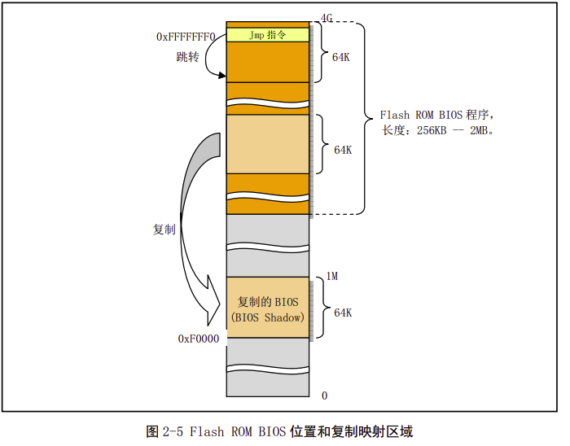
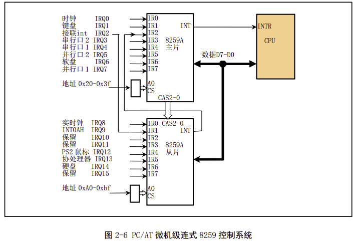

老式计算机组成如图所示，由cpu和各个模块组成。cpu通过地址线、数据线和内部总线（控制线）与系统其他部分进行数据通信。

地址线用于提供内存或io设备的地址，即表明读写数据的位置。

数据线用于cpu、内存、io设备之间提供数据传输的通道。

而控制线负责执行读写操作。

对于80368CPU的pc，内部地址线和数据线都分别有32根，因此是32位的。

我们知道，cpu和内存需要高速的传输速率。而其他设备相对低、中速。因此后续的pc发展成北桥芯片用于与cpu、内存、AGP视频接口，南桥芯片管理pci总线、ide硬件接口、USB端口。我们学习Linux0.11源码，需要老式的微型pc，好在微型pc机仍然适用于现代pc机结构。

## 2.2 I/O端口寻址

cpu访问io端口地址有两种：

- 统一编址：io端口地址归入存储器寻址地址空间，那么cpu可以通过访问内存的操作一样访问对应端口设备的寄存器
- 独立编址：io端口的寻址空间作为一个独立的地址空间，称为io地址空间，通过特定的指令访问

## 2.3 主存储器 BIOS CMOS存储器

主存储器即内存（RAM）

RAM和ROM的区别：内存是一种RAM技术，需要不间断的供电，一旦断电则数据丢失 优点是读取速度很快

而硬盘是一种ROM技术，可以永久存储，但读取速度很慢

计算机初始上电的时候，内存中的0xA0000-0xFFFFF(64K-1M)被用作i/o地址空间 0xFFFE0000-0xFFFFFFFF(4G处的最后一个64K)被用作BIOS程序 

在物理内存只有16MB的pc机中，0--640K用于存放内核代码和数据，640K--1M被用作i/o地址空间，其中0xA0000开始的128K被用作缓存，而0xF0000-1M被用作ROM BIOS的映射区

CMOS存储器 这是一种容量很小的存储器 用来存储实时时钟信信和硬件配置信息

## 2.4 控制器和控制卡

### 2.4.1 中断控制器

计算机初始化的时候，BIOS会对时钟芯片初始化 并将15级中断优先级分配给时钟定时器 键盘 穿行口 打印口 软盘控制器 协处理器和硬盘等设备或控制器使用。同时在0x000--0xFFF区域建立一个中断向量表。

### 2.4.2 DMA控制器（8237芯片）

DMA控制器的主要功能是让外部设备直接和内存进行数据传输 从而不受CPU控制，CPU可以做其他事情 一般软盘是通过DMA控制器传输数据的

### 2.4.3 定时/计数器（8253/8254芯片）

处理计算机精确时间延迟

Linux0.11操作系统对通道0进行重新设置 使得计数器工作在方式3下 每隔10ms产生一个中断信号 Linux系统用这个中断信号定时切换当前执行的任务和统计每个任务使用的系统资源

### 2.4.4 键盘控制器

